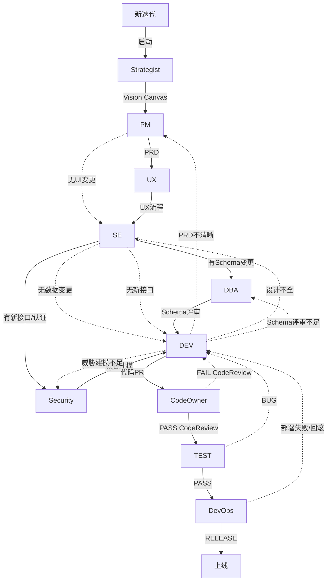

# Enterprise Workflow — 架构设计文档

> 版本: v1 | 日期: 2026-06-19

## 1. 概述

Enterprise Workflow 是一套基于 ZCode Skill 体系的企业级角色分工开发流程。它将模糊需求通过多个专业 AI Agent（PM/UX/SE/DEV/TEST/...）逐步转化为可交付的软件，每个角色产出标准化的文档或代码，最终形成完整的交付链条。

### 核心设计原则

1. **文件即接口** — 角色之间不直接对话，通过 `docs/` 下的标准化文件传递信息
2. **每个角色独立上下文** — Agent 只读取它该看的输入文件，避免信息污染
3. **自检而非外审** — 每个角色的 Gate 清单是自检工具，不是独立的审查阶段
4. **编排器只调度** — 编排器不替角色做决策，只负责读取状态、启动 Agent、写入文件
5. **增量更新** — 修改已有文件使用精确 patch，不重写整个文件

## 2. 角色体系

### 2.1 工作流（执行顺序 + 反馈回路）



**跳过决策：**

| 角色 | 谁判断跳过 | 跳过条件 |
|------|-----------|---------|
| UX | PM | PRD 中无 UI 变更 |
| DBA | SE | 架构中无 Schema/索引变更 |
| Security | SE | 架构中无新接口/新认证/敏感数据 |
| DevOps | — | 始终保留 |

**反馈回路：**

| 触发者 | 触发条件 | 打回目标 |
|--------|---------|---------|
| DEV | PRD 验收标准不可编码 | PM |
| DEV | ADR/架构/API 不可执行 | SE |
| DEV | Schema评审/威胁建模不够具体 | DBA / Security |
| CodeOwner | CodeReview 不通过 | DEV |
| TEST | 测试发现 Bug | DEV |
| DevOps | 部署失败/需回滚 | DEV |

### 2.2 依赖关系（角色读取 + 审查）

```mermaid
graph TB
    subgraph 产出物
        VC[Vision Canvas]
        PRD_OUT[PRD]
        UX_OUT[UX流程]
        ADR_OUT[ADR]
        ARCH_OUT[架构图]
        API_OUT[API契约]
        DBA_OUT[Schema评审]
        SEC_OUT[威胁建模]
        CODE[代码变更]
        REVIEW[Review Report]
        TEST_OUT[测试报告]
    end

    subgraph Strategist
        S_IN[Strategist]
    end

    subgraph PM
        PM_IN[PM] -->|读| VC
    end

    subgraph UX
        UX_IN[UX] -->|读| PRD_OUT
    end

    subgraph SE
        SE_IN[SE] -->|读| PRD_OUT
        SE_IN -->|读| UX_OUT
    end

    subgraph DBA
        DBA_IN[DBA] -->|读| ADR_OUT
        DBA_IN -->|读| ARCH_OUT
    end

    subgraph Security
        SEC_IN[Security] -->|读| ADR_OUT
        SEC_IN -->|读| ARCH_OUT
        SEC_IN -->|读| API_OUT
    end

    subgraph DEV
        DEV_IN[DEV] -->|读| PRD_OUT
        DEV_IN -->|读| ADR_OUT
        DEV_IN -->|读| ARCH_OUT
        DEV_IN -->|读| API_OUT
        DEV_IN -->|读| DBA_OUT
        DEV_IN -->|读| SEC_OUT
    end

    subgraph CodeOwner
        CO_IN[CodeOwner] -->|读| PRD_OUT
        CO_IN -->|读| ADR_OUT
        CO_IN -->|读| ARCH_OUT
        CO_IN -->|读| API_OUT
        CO_IN -->|读| DBA_OUT
        CO_IN -->|读| SEC_OUT
        CO_IN -->|读| CODE
    end

    subgraph TEST
        TEST_IN[TEST] -->|读| PRD_OUT
        TEST_IN -->|读| API_OUT
        TEST_IN -->|读| UX_OUT
        TEST_IN -.->|可选| DBA_OUT
        TEST_IN -.->|可选| SEC_OUT
    end

    subgraph DevOps
        DO_IN[DevOps] -->|读| ADR_OUT
        DO_IN -->|读| ARCH_OUT
        DO_IN -->|读| TEST_OUT
    end
```



### 2.3 角色职责摘要

| # | 角色 | 职责 | 输入 | 产出 |
|---|------|------|------|------|
| 0 | **Strategist** | 产品方向、竞品研究、Vision Canvas | 市场/竞品数据 | `docs/product/vision-canvas.md` |
| 1 | **PM** | 需求分析、PRD、验收标准 | Vision Canvas | `docs/prd/{feature}.md` |
| 2 | **UX** | 用户流程、交互设计 | PRD | `docs/ux/flow-{feature}.md` |
| 3 | **SE** | 架构设计、ADR、API 契约 | PRD + UX 流程 | `docs/adr/` + `docs/arch/` + `docs/api/` |
| 4 | **DBA** | Schema 评审、索引策略 | ADR + 架构图（数据模型） | `docs/dba/schema-review-{feature}.md` |
| 5 | **Security** | 威胁建模、OWASP 检查 | ADR + 架构图 + API 契约 | `docs/security/threat-model-{feature}.md` |
| 6 | **DEV** | 代码实现（TDD） | PRD + ADR + 架构图 + API 契约 | 代码变更 + 自检报告 |
| 7 | **CodeOwner** | 代码审查、合并审批、版本标签 | DEV 代码 + PRD + ADR + 架构图 | `docs/review/report-{feature}.md` + 版本 Tag |
| 8 | **TEST** | 测试策略、测试用例、验收测试 | PRD + API 契约 + UX 流程 | `docs/test/strategy-{feature}.md` + `docs/test/cases-{feature}.md` |
| 9 | **DevOps** | 部署方案、灰度策略、监控告警 | ADR + 架构图（非功能需求） | `docs/deploy/gray-release-{feature}.md` |

### 2.3 角色设计原则

- **单一视角**：每个角色只关注自己领域的问题，不越界
- **禁止读取**：每个角色明确列出禁止读取的文件，避免信息污染
- **输入即边界**：角色仅处理输入契约中列出的文件，不假设不推测
- **确定性产出**：每个结论引用具体输入文件 + 章节/行号

## 3. 编排器设计

### 3.1 状态管理

编排器通过 `docs/.workflow/state.json` 管理流程状态：

```json
{
  "feature": "{feature-name}",
  "current_phase": "strategist",
  "phases": {
    "strategist": {"status": "pending"},
    "pm": {"status": "pending"},
    ...
  }
}
```

每个阶段追踪：状态（pending/running/completed/failed/stale）、版本号、产出物路径。

### 3.2 执行循环

每个阶段的标准流程：
1. 读取状态 → 检查依赖
2. 从角色 SKILL.md 提取输入契约 + 产出模板 + 方法论
3. 构造 Agent prompt → 启动 Agent
4. Agent 产出后，角色按 Gate 清单自检
5. 编排器将产出写入 `docs/` 对应文件
6. 更新 state.json，推进到下一阶段

### 3.3 返工与级联 Stale

当上游角色重新产出时，直接下游自动标记为 `stale`：
- Strategist → PM → UX → SE → DBA, Security, DEV
- DEV → CodeOwner
- CodeOwner → TEST
- TEST → DevOps

### 3.4 DEV↔CodeOwner 反馈循环

这是流程中唯一的自动循环（非标准线性推进）：

```
DEV(rc1) → CodeOwner审查 → FAIL
    ↓
DEV(rc2) ← Review Report 作为额外输入
    ↓
CodeOwner再次审查 → PASS → TEST
```

- 编排器自动完成循环，无需用户手动触发 `/flow retry`
- 最多 3 轮（rc3），超过后暂停，用户手动介入
- CodeOwner 自身 Gate 通过但审批结论为「打回」时触发

## 4. Agent 设计约束

所有角色 Agent 遵循两条硬约束：

1. **Agent 不是人** — 角色定义描述职责和边界，不构建人设。禁止心理活动、社交动词、时间感知、人类流程隐喻
2. **编排器是唯一调度者** — 角色之间不描述「和 XX 讨论」「找 XX 确认」等人际交互。编排器负责所有 Agent 之间的信息传递

## 5. 当前局限

### 5.1 已解决

| 问题 | 解决方案 |
|------|---------|
| DEV→CodeOwner 审查循环 | 编排器自动 rc 递增，最多 3 轮 |
| TEST Bug 反馈 | TEST→DEV 回路 |
| 部署失败反馈 | DevOps→DEV 回路 |
| DEV 发现上游设计不足 | DEV→PM/SE/DBA/Security 回路 |
| UX/DBA/Security 条件跳过 | PM/SE 输出中标注跳过条件 |

### 5.2 待解决

| 局限 | 说明 |
|------|------|
| 缺少 Release Notes | 没有面向用户的版本变更说明 |
| 缺少性能测试 | TEST 只管功能，无人管压测 |
| 缺少依赖审计 | DEV 引入新依赖时无安全/许可证检查 |
| PM 验收确认 | 缺少 PM 对照 TEST 报告逐条确认 AC 的环节 |
| 跨角色自检标准不统一 | 有角色用 Gate 自检，有角色未定义自检流程 |
